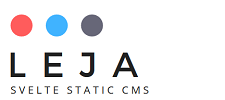

# Leja

:brazil:

Leja é um sistema de blog estático desenvolvido a partir do  svelte, que está em sua fase beta :)

:uk:

Leja is a beta static CMS svelte-based :)

## Origem do nome

:brazil:

Um dos significados de `svelte` é *talhado*, o que me fez lembrar do [https://pt.wikipedia.org/wiki/Aleijadinho](Aleijadinho), importante artista brasileiro, que com suas artes talhadas se tornou conhecido. 

:uk:

A tribute to [https://en.wikipedia.org/wiki/Aleijadinho](Aleijadinho), an important brazilian artist.
